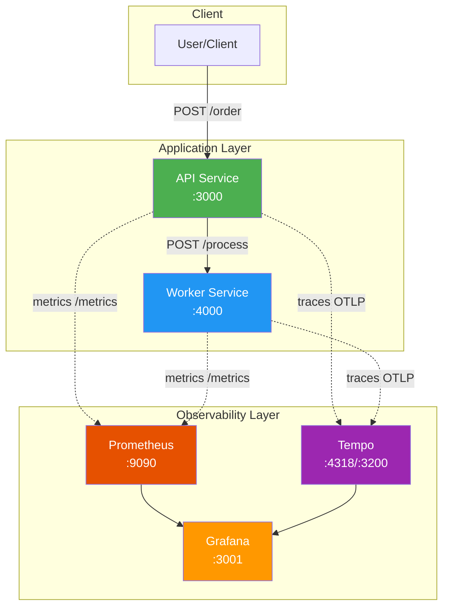
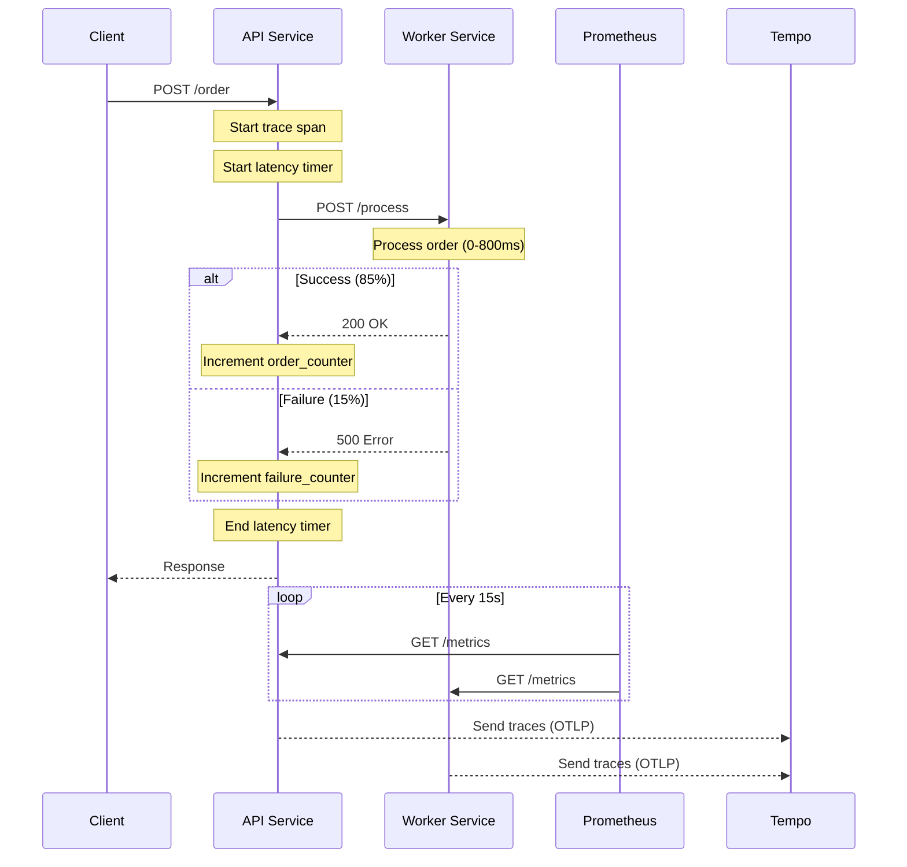

# 🔭 Practical Monitoring & Observability Blueprint

A production-ready observability stack demonstrating the **three pillars of observability** — **Metrics**, **Logs**, and **Traces** — using industry-standard open-source tools. This project showcases how to build comprehensive monitoring for distributed microservices.

---

## 📖 Table of Contents

- [🔭 Practical Monitoring & Observability Blueprint](#-practical-monitoring--observability-blueprint)
  - [📖 Table of Contents](#-table-of-contents)
  - [🎯 About the Project](#-about-the-project)
  - [🏗️ Architecture Overview](#️-architecture-overview)
  - [📊 Data Flow](#-data-flow)
  - [🧩 Components](#-components)
    - [Application Services](#application-services)
    - [Observability Stack](#observability-stack)
  - [❓ Why This Solution?](#-why-this-solution)
    - [Practical Problems Solved](#practical-problems-solved)
  - [⚖️ Potential Tradeoffs](#️-potential-tradeoffs)
  - [🚀 Getting Started](#-getting-started)
    - [Prerequisites](#prerequisites)
    - [Running with Docker Compose](#running-with-docker-compose)
    - [Accessing Services](#accessing-services)
  - [🔌 API Reference](#-api-reference)
  - [📈 Metrics Exposed](#-metrics-exposed)
  - [🛠️ Technology Stack](#️-technology-stack)
  - [📁 Project Structure](#-project-structure)
  - [📚 Further Reading](#-further-reading)

---

## 🎯 About the Project

This project implements a **microservices order processing system** with full observability instrumentation. It simulates a real-world scenario where:

1. An **API Service** receives order requests from clients
2. A **Worker Service** processes the orders asynchronously
3. All telemetry data (metrics, logs, traces) is collected and visualized

The stack demonstrates how to:
- 📊 Collect and visualize **metrics** with Prometheus + Grafana
- 🔍 Implement **distributed tracing** with OpenTelemetry + Tempo
- 📝 Generate **structured logs** with Pino logger
- 🔗 Correlate data across all three pillars

---

## 🏗️ Architecture Overview

```
┌─────────────────────────────────────────────────────────────────────────────┐
│                          OBSERVABILITY LAYER                                │
│  ┌─────────────────┐    ┌─────────────────┐    ┌─────────────────────────┐  │
│  │    Grafana      │    │   Prometheus    │    │        Tempo            │  │
│  │   (Dashboard)   │◄───│    (Metrics)    │    │   (Distributed Tracing) │  │
│  │   Port: 3001    │    │   Port: 9090    │    │   Port: 3200, 4318      │  │
│  └─────────────────┘    └────────┬────────┘    └───────────▲─────────────┘  │
│                                  │ scrape                  │ traces         │
└──────────────────────────────────┼─────────────────────────┼────────────────┘
                                   │                         │
┌──────────────────────────────────┼─────────────────────────┼────────────────┐
│                          APPLICATION LAYER                 │                │
│                                  │                         │                │
│  ┌───────────────────────────────▼─────────────────────────┴──────────────┐ │
│  │                         API Service                                    │ │
│  │                         (Port: 3000)                                   │ │
│  │  ┌──────────┐  ┌──────────┐  ┌───────────────┐  ┌──────────────────┐  │ │
│  │  │ Express  │  │  Pino    │  │ OpenTelemetry │  │  Prom-Client     │  │ │
│  │  │  Server  │  │  Logger  │  │    Tracing    │  │     Metrics      │  │ │
│  │  └──────────┘  └──────────┘  └───────────────┘  └──────────────────┘  │ │
│  └─────────────────────────────────┬──────────────────────────────────────┘ │
│                                    │ HTTP POST /process                     │
│  ┌─────────────────────────────────▼──────────────────────────────────────┐ │
│  │                       Worker Service                                   │ │
│  │                         (Port: 4000)                                   │ │
│  │  ┌──────────┐  ┌──────────┐  ┌───────────────┐  ┌──────────────────┐  │ │
│  │  │ Express  │  │  Pino    │  │ OpenTelemetry │  │  Prom-Client     │  │ │
│  │  │  Server  │  │  Logger  │  │    Tracing    │  │     Metrics      │  │ │
│  │  └──────────┘  └──────────┘  └───────────────┘  └──────────────────┘  │ │
│  └────────────────────────────────────────────────────────────────────────┘ │
│                                                                             │
└─────────────────────────────────────────────────────────────────────────────┘
```

### Mermaid Diagram



---

## 📊 Data Flow

### Request Flow



### Data Storage Flow

| Data Type | Collection Method | Storage | Visualization |
|-----------|-------------------|---------|---------------|
| **Metrics** | Prometheus scrapes `/metrics` endpoint | Prometheus TSDB | Grafana dashboards |
| **Traces** | OpenTelemetry SDK sends via OTLP | Tempo (local storage) | Grafana Tempo datasource |
| **Logs** | Pino structured JSON output | Docker logs / stdout | Docker logs / Loki (optional) |

---

## 🧩 Components

### Application Services

#### API Service (`services/api`)

| Aspect | Details |
|--------|---------|
| **Port** | 3000 |
| **Purpose** | Entry point for order creation |
| **Endpoints** | `POST /order`, `GET /metrics`, `GET /health` |
| **Instrumentation** | OpenTelemetry traces, Prometheus metrics, Pino logs |

**Key Features:**
- Receives order requests and delegates processing to Worker
- Exposes business metrics (orders created, failures, latency)
- Implements distributed tracing with automatic context propagation

#### Worker Service (`services/worker`)

| Aspect | Details |
|--------|---------|
| **Port** | 4000 |
| **Purpose** | Background job processing |
| **Endpoints** | `POST /process`, `GET /metrics`, `GET /health` |
| **Instrumentation** | OpenTelemetry traces, Prometheus metrics, Pino logs |

**Key Features:**
- Simulates async work with random latency (0-800ms)
- Simulates failures (~15% failure rate) for testing alerting
- Exposes job processing metrics

### Observability Stack

| Component | Version | Purpose | Port(s) |
|-----------|---------|---------|---------|
| **Grafana** | latest | Unified visualization dashboard | 3001 |
| **Prometheus** | latest | Metrics collection & storage | 9090 |
| **Tempo** | 2.4.1 | Distributed trace storage | 3200, 4318 |

---

## ❓ Why This Solution?

### Practical Problems Solved

| Problem | How This Stack Solves It |
|---------|--------------------------|
| **"Where is the bottleneck?"** | Distributed tracing shows exact latency at each service hop |
| **"Why did that request fail?"** | Traces correlate with logs and metrics for root cause analysis |
| **"Is the system healthy?"** | Prometheus metrics + Grafana dashboards provide real-time health |
| **"How do I debug production issues?"** | OpenTelemetry auto-instrumentation captures HTTP, database, and more |
| **"How do services communicate?"** | Trace visualization shows service dependencies and call patterns |
| **"What's my error rate?"** | Custom counters track success/failure rates precisely |

### Why These Specific Tools?

| Tool | Reasoning |
|------|-----------|
| **OpenTelemetry** | Vendor-neutral, industry standard, huge ecosystem support |
| **Prometheus** | Pull-based model simplifies networking, powerful PromQL |
| **Tempo** | Efficient trace storage, native Grafana integration, cost-effective |
| **Grafana** | Unified UI for all observability data, extensive plugin ecosystem |
| **Pino** | Fastest Node.js logger, structured JSON output for log aggregation |

---

## ⚖️ Potential Tradeoffs

### Technical Tradeoffs

| Aspect | Tradeoff | Mitigation |
|--------|----------|------------|
| **Resource Overhead** | Tracing adds ~2-5% CPU overhead | Use sampling in production |
| **Storage Growth** | Metrics/traces grow continuously | Configure retention policies, use aggregation |
| **Network Latency** | OTLP exports add network calls | Use batch exporters, async sending |
| **Complexity** | Multiple services to manage | Docker Compose simplifies orchestration |

### Architecture Tradeoffs

| Decision | Pros | Cons |
|----------|------|------|
| **Pull-based metrics (Prometheus)** | Simple firewall rules, service controls exposure | Doesn't work well with ephemeral/serverless |
| **Local Tempo storage** | Simple setup, no external dependencies | Not suitable for production scale |
| **Separate API/Worker** | Demonstrates distributed tracing value | Adds complexity vs monolith |
| **Auto-instrumentation** | Zero-code tracing setup | Less control over span details |

### When NOT to Use This Stack

- **Simple single-service apps**: Overhead not justified
- **Serverless-heavy architectures**: Push-based metrics (CloudWatch, etc.) may fit better
- **Very high-volume traces**: Consider sampling or managed solutions (Datadog, Honeycomb)
- **Strict compliance requirements**: May need audit features not in these tools

---

## 🚀 Getting Started

### Prerequisites

- **Docker** (>= 20.10)
- **Docker Compose** (>= 2.0)
- **Git** (for cloning the repository)

Verify your installations:

```bash
docker --version
docker compose version
```

### Running with Docker Compose

1. **Clone the repository**

   ```bash
   git clone https://github.com/raqibdev/practical-monitoring-observability-blueprint.git
   cd practical-monitoring-observability-blueprint
   ```

2. **Start all services**

   ```bash
   docker compose up --build
   ```

   This will:
   - Build the API and Worker service images
   - Start all 5 containers (api, worker, prometheus, tempo, grafana)
   - Create the internal Docker network for service communication

3. **Generate some traffic**

   In a new terminal, send test orders:

   ```bash
   # Single order
   curl -X POST http://localhost:3000/order -H "Content-Type: application/json"

   # Generate multiple orders
   for i in {1..20}; do
     curl -X POST http://localhost:3000/order -H "Content-Type: application/json"
     sleep 0.5
   done
   ```

4. **View observability data**

   - **Grafana**: http://localhost:3001 (admin/admin)
   - **Prometheus**: http://localhost:9090
   - **Tempo**: http://localhost:3200

5. **Stop services**

   ```bash
   docker compose down
   ```

   To remove volumes as well:

   ```bash
   docker compose down -v
   ```

### Accessing Services

| Service | URL | Credentials |
|---------|-----|-------------|
| **API Service** | http://localhost:3000 | - |
| **Worker Service** | http://localhost:4000 | - |
| **Grafana** | http://localhost:3001 | admin / admin |
| **Prometheus** | http://localhost:9090 | - |
| **Tempo** | http://localhost:3200 | - |

---

## 🔌 API Reference

### API Service Endpoints

| Method | Endpoint | Description | Response |
|--------|----------|-------------|----------|
| `POST` | `/order` | Create a new order | `{"status": "order created"}` or `{"error": "..."}` |
| `GET` | `/metrics` | Prometheus metrics | Prometheus format text |
| `GET` | `/health` | Health check | `{"status": "ok"}` |

### Worker Service Endpoints

| Method | Endpoint | Description | Response |
|--------|----------|-------------|----------|
| `POST` | `/process` | Process a job | `{"status": "job done"}` or `{"error": "job failed"}` |
| `GET` | `/metrics` | Prometheus metrics | Prometheus format text |
| `GET` | `/health` | Health check | `{"status": "ok"}` |

---

## 📈 Metrics Exposed

### API Service Metrics

| Metric | Type | Description |
|--------|------|-------------|
| `orders_created_total` | Counter | Total successful orders |
| `orders_failed_total` | Counter | Total failed orders |
| `order_latency_seconds` | Histogram | Order processing latency distribution |

### Worker Service Metrics

| Metric | Type | Description |
|--------|------|-------------|
| `jobs_processed_total` | Counter | Total successful jobs |
| `jobs_failed_total` | Counter | Total failed jobs |
| `job_processing_seconds` | Histogram | Job processing latency distribution |

### Example PromQL Queries

```promql
# Order success rate (last 5 minutes)
rate(orders_created_total[5m]) / (rate(orders_created_total[5m]) + rate(orders_failed_total[5m]))

# 95th percentile order latency
histogram_quantile(0.95, rate(order_latency_seconds_bucket[5m]))

# Error rate percentage
rate(orders_failed_total[5m]) * 100 / (rate(orders_created_total[5m]) + rate(orders_failed_total[5m]))
```

---

## 🛠️ Technology Stack

| Category | Technology | Version |
|----------|------------|---------|
| **Runtime** | Node.js | 20 (Alpine) |
| **Framework** | Express | 5.x |
| **Tracing** | OpenTelemetry | 0.211.x |
| **Metrics** | prom-client | 15.x |
| **Logging** | Pino | 10.x |
| **Traces Storage** | Grafana Tempo | 2.4.1 |
| **Metrics Storage** | Prometheus | latest |
| **Visualization** | Grafana | latest |
| **Containerization** | Docker | 20.10+ |
| **Orchestration** | Docker Compose | 2.0+ |

---

## 📁 Project Structure

```
practical-monitoring-observability-blueprint/
├── docker-compose.yml          # Container orchestration
├── README.md                   # This file
│
├── services/
│   ├── api/                    # API Service
│   │   ├── Dockerfile          # Container build
│   │   ├── package.json        # Dependencies
│   │   ├── app.js              # Express server + metrics
│   │   └── tracing.js          # OpenTelemetry setup
│   │
│   └── worker/                 # Worker Service
│       ├── Dockerfile          # Container build
│       ├── package.json        # Dependencies
│       ├── app.js              # Express server + metrics
│       └── tracing.js          # OpenTelemetry setup
│
├── observability/
│   ├── prometheus/
│   │   └── prometheus.yml      # Prometheus scrape config
│   │
│   ├── tempo/
│   │   └── tempo.yaml          # Tempo trace storage config
│   │
│   ├── grafana/                # Grafana dashboards (optional)
│   └── loki/                   # Loki config (optional)
│
└── runbooks/                   # Operational runbooks (optional)
```

---

## 📚 Further Reading

- [OpenTelemetry Documentation](https://opentelemetry.io/docs/)
- [Prometheus Best Practices](https://prometheus.io/docs/practices/)
- [Grafana Tempo Documentation](https://grafana.com/docs/tempo/latest/)
- [The Three Pillars of Observability](https://www.oreilly.com/library/view/distributed-systems-observability/9781492033431/ch04.html)
- [Pino Logger](https://getpino.io/)

---

<div align="center">

**Built with ❤️ for learning observability in distributed systems**

*Star ⭐ this repo if you found it helpful!*

</div>
